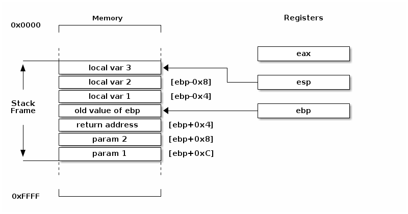
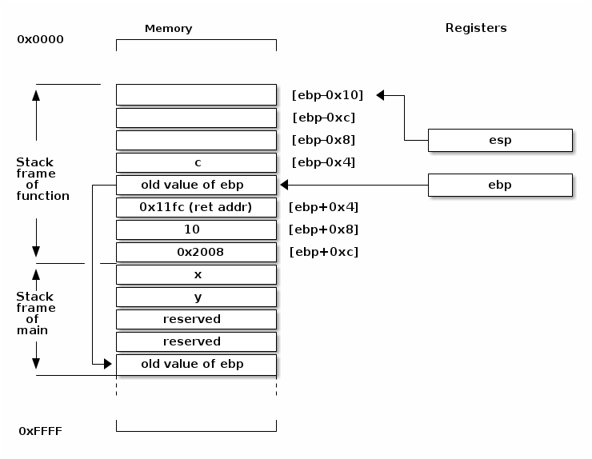

<h1><center>Elements of the x86 computer architecture</center></h1>
<p><strong>Authors</strong>Giuseppe Lipari</p>

<a rel="license" href="http://creativecommons.org/licenses/by-nc-sa/4.0/"></a><br />This work is licensed under a <a rel="license" href="http://creativecommons.org/licenses/by-nc-sa/4.0/">Creative Commons Attribution-NonCommercial-ShareAlike 4.0 International License</a>.


# Table of Contents

1.  [Introduction](#orgcdeecdb)
2.  [Registers and memory](#org7962e46)
3.  [Machine instructions for Intel x86 architectures](#org884f0a9)
4.  [The stack frame](#org9d29138)
    1.  [Example](#orge2bd756)
    2.  [Summary](#orgc37e986)
5.  [Acknowledgements](#org84dbf69)
6.  [Bibliography](#org87c6fa0)


<a id="orgcdeecdb"></a>

# Introduction

The goal of this document is to explain some basic notions of computer architecture for use in an Operating System course.

First, we will explain the use of the stack to implement functions calls in C. Therefore, we will briefly recall some notion of computer architecture and assembler for the Intel 32bit x86 architecture (also referred to as i386).


<a id="org7962e46"></a>

# Registers and memory

Processors of the x86 family use internal registers to perform operations. We will describe here only the ones that are relevant to our goal.

-   `eip` : instruction pointer
    
    This register holds the address in memory of the next instruction to be executed by the processor. Every time the processor executes one instruction, the EIP register is automatically incremented so to point to the next instruction in memory. The register can also be modified by jump instruction line `jmp`, `je`, `call`, `ret`, etc. (see below).

-   `eax`, `ebx`, `ecx`, etc.
    
    These are generic registers used as temporary working variables when executing the code. Some of there registers are conventionally used for specific purpouses. For example, the `eax` register is often used to store the return value of functions.

-   `esp` and `ebp`
    
    These register hold the addresses in memory for the stack. As we will see later on, the stack is a range of adresses in memory used by C programs to store local variables and the parameters of function calls. In particular, `esp` points to the top of the stack, where `ebp` points to the base of the current stack *frame*.


<a id="org884f0a9"></a>

# Machine instructions for Intel x86 architectures

-   `mov` — Move (Opcodes: 88, 89, 8A, 8B, 8C, 8E, &#x2026;)
    
    The mov instruction copies the data item referred to by its second operand (i.e. register contents, memory contents, or a constant value) into the location referred to by its first operand (i.e. a register or memory). While register-to-register moves are possible, direct memory-to-memory moves are not. In cases where memory transfers are desired, the source memory contents must first be loaded into a register, then can be stored to the destination memory address.
    
    -   Examples:
        
            mov eax, ebx — copy the value in ebx into eax

-   `push` — Push stack (Opcodes: FF, 89, 8A, 8B, 8C, 8E, &#x2026;)
    
    The push instruction places its operand onto the top of the hardware supported stack in memory. Specifically, push first decrements ESP by 4, then places its operand into the contents of the 32-bit location at address [ESP]. ESP (the stack pointer) is decremented by push since the x86 stack grows down - i.e. the stack grows from high addresses to lower addresses.
    
    -   Examples :
        
            push eax — push eax on the stack
            push [var] — push the 4 bytes at address var onto the stack

-   `pop` — Pop stack
    
    The pop instruction removes the 4-byte data element from the top of the hardware-supported stack into the specified operand (i.e. register or memory location). It first moves the 4 bytes located at memory location [ESP] into the specified register or memory location, and then increments ESP by 4.
    
    -   Examples:
        
            pop edi — pop the top element of the stack into EDI.
            pop [ebx] — pop the top element of the stack into memory at the four bytes 
                        starting at location EBX.

-   `lea` — Load effective address
    
    The lea instruction places the address specified by its second operand into the register specified by its first operand. Note, the contents of the memory location are not loaded, only the effective address is computed and placed into the register. This is useful for obtaining a pointer into a memory region.
    
    -   Examples :
        
            lea edi, [ebx+4*esi] — the quantity EBX+4*ESI is placed in EDI.
            lea eax, [var] — the value in var is placed in EAX.
            lea eax, [val] — the value val is placed in EAX.

-   `add` — Integer Addition
    
    The add instruction adds together its two operands, storing the result in its first operand. Note, whereas both operands may be registers, at most one operand may be a memory location.

-   `sub` — Integer Subtraction
    
    The sub instruction stores in the value of its first operand the result of subtracting the value of its second operand from the value of its first operand. As with add

-   `and`, `or`, `xor` — Bitwise logical and, or and exclusive or
    
    These instructions perform the specified logical operation (logical bitwise and, or, and exclusive or, respectively) on their operands, placing the result in the first operand location.

-   `test` — bitwise logical and on two operands
    
    Unlike the and instruction, the result of the test is not stored in the register, only the flags are modified, in particular the Zero Flag (`ZF`) is set to 1 if the result of the operation is 0.

-   `cmp` — Compare
    
    Compare the values of the two specified operands, setting the condition codes in the machine status word appropriately. This instruction is equivalent to the sub instruction, except the result of the subtraction is discarded instead of replacing the first operand.
    
    -   Example :
        
            cmp DWORD PTR [var], 10
            jeq loop 
        
        If the 4 bytes stored at location var are equal to the 4-byte integer constant 10, jump to the location labeled loop.

-   `jmp` — Jump
    
    Transfers program control flow to the instruction at the memory location indicated by the operand.

-   `jcondition` — Conditional Jump
    
    These instructions are conditional jumps that are based on the status of a set of condition codes that are stored in a special register called the machine status word. The contents of the machine status word include information about the last arithmetic operation performed. For example, one bit of this word indicates if the last result was zero. Another indicates if the last result was negative. Based on these condition codes, a number of conditional jumps can be performed. For example, the `jz` instruction performs a jump to the specified operand label if the result of the last arithmetic operation was zero. Otherwise, control proceeds to the next instruction in sequence.
    
    A number of the conditional branches are given names that are intuitively based on the last operation performed being a special compare instruction, cmp (see below). For example, conditional branches such as jle and jne are based on first performing a cmp operation on the desired operands.
    
    -   Syntax
        
            je <label> (jump when equal)
            jne <label> (jump when not equal)
            jz <label> (jump when last result was zero)  
            jg <label> (jump when greater than)
            jge <label> (jump when greater than or equal to)
            jl <label> (jump when less than)
            jle <label> (jump when less than or equal to)
    
    -   Example:
        
            cmp eax, ebx
            jle done

-   `call`, `ret` — Subroutine call and return
    
    These instructions implement a subroutine call and return. The call instruction first pushes the current code location onto the hardware supported stack in memory (see the push instruction for details), and then performs an unconditional jump to the code location indicated by the label operand. Unlike the simple jump instructions, the call instruction saves the location to return to when the subroutine completes.
    
    The ret instruction implements a subroutine return mechanism. This instruction first pops a code location off the hardware supported in-memory stack (see the pop instruction for details). It then performs an unconditional jump to the retrieved code location.

-   `leave`
    
    This instruction is equivalent to the following sequence :
    
        mov  esp, ebp
        pop  ebp


<a id="org9d29138"></a>

# The stack frame

When calling a function, the compiler follows a specific *calling convention* which is widely used by all compilers. Many other languages follow the same convention: in this way, it is possible to call C functions from other languages, and inversely call non-C function from within C programs.

The C language call convention makes use of the stack to store

-   the parameters of the function call
-   the return address of the caller
-   the local variables of the function.

To do this, the compiler uses two registers:

-   The `esp` register (stack pointer)
-   the `ebp` register (base pointer)

The memory space containing the parameters, the return address and the local variables of the function is called **stack frame**. A general schema is presented in Figure [55](#orga9ff929).




<a id="orge2bd756"></a>

## Example

Consider the C program in Listing [1](#org5d20ea7) (also available in file `example/stack-example.c`).

```c
#include <stdio.h>

int function(int a, const char *s)
{
    int c = 0;
    while (s[c] != 0) c++;

    return c - a;
}

const char string[] = "Hello world!";
int x, y;

int main()
{
    y = 10;
    x = function(y, string);

    printf("x = %d\n", x);
    return 0;
}
```

In Listing [2](#org2099840) we show the translation of `function()` in machine code interleaved by the source code, obtained by running the command `objdump` on the object file (see `example/Makefile`). In Listing [3](#org7d9a443) we report the translation of the function call in the main.

```c
int function(int a, const char *s)
{
    11ad:        55                           push   ebp
    11ae:        89 e5                        mov    ebp,esp
    11b0:        83 ec 10                     sub    esp,0x10
    int c = 0;
    11b3:        c7 45 fc 00 00 00 00         mov    DWORD PTR [ebp-0x4],0x0
    while (s[c] != 0) c++;
    11ba:        eb 04                        jmp    11c0 <function+0x13>
    11bc:        83 45 fc 01                  add    DWORD PTR [ebp-0x4],0x1
    11c0:        8b 55 fc                     mov    edx,DWORD PTR [ebp-0x4]
    11c3:        8b 45 0c                     mov    eax,DWORD PTR [ebp+0xc]
    11c6:        01 d0                        add    eax,edx
    11c8:        0f b6 00                     movzx  eax,BYTE PTR [eax]
    11cb:        84 c0                        test   al,al
    11cd:        75 ed                        jne    11bc <function+0xf>

    return c - a;
    11cf:        8b 45 fc                     mov    eax,DWORD PTR [ebp-0x4]
    11d2:        2b 45 08                     sub    eax,DWORD PTR [ebp+0x8]
}
    11d5:        c9                           leave  
    11d6:        c3                           ret    
```

```c
int x, y;
y = 10;
11e8:        c7 45 f4 0a 00 00 00         mov    DWORD PTR [ebp-0xc],0xa
x = function(y, string);
11ef:        68 08 20 00 00               push   0x2008
11f4:        ff 75 f4                     push   DWORD PTR [ebp-0xc]
11f7:        e8 b1 ff ff ff               call   11ad <function>
11fc:        83 c4 08                     add    esp,0x8
11ff:        89 45 f0                     mov    DWORD PTR [ebp-0x10],eax
```

Let us start by analysing Listing [3](#org7d9a443). First of all, `main()` is also a function, so it also has a stack frame. The state of the stack before executing the code snippet of Listing [3](#org7d9a443) is shown in Figure [59](#orgee8119f).

.")

Here is what happens :

-   line 3: the value `0xa` (10 in decimal) is loaded at address `[ebp-0xc]` where the local variable `y` is stored
-   line 5: the address `0x2008` (which correspond to the start of array `string`) is pushed onto the stack.
-   line 6: the value of `y` is pushed into the stack

This creates the first part of the *stack frame* of `function` which contains the value of the parameters.

-   line 7: the current `eip` address is pushed in the stack (it corresponds to the address of the next instructions after the `call`, which is `0x11fc`).

Now the execution continues from address `0x11ad` which is the first instruction of the function (Listing [2](#org2099840)).

-   line 3: the value of `ebp` is saved on the stack
-   line 4: `ebp` now contains the current value of the stack pointer `esp`
-   line 5 the function subtracts `0x10` (16 in decimal) from `esp`: this is used to make space for the local variable. For alignement reasons, the compiler allocates more than needed, in the following it will just use the first position of the stack.
-   line 7: variable `c` (which is stored at position `ebp`) is initialized to 0
-   line 9-16: the code of the while loop. Notice how the compiler accesses local variables and parameters using `ebp` and a offset (*displacement*). In particular, for local variables a negative offset is used, and for parameters a positive offset.
-   line 19-10: the value to be returned is stored into register `eax`
-   line 22: the compiler uses the `leave` instruction to restore the value of `esp` and `ebp`, thus eliminating the local variables
-   line 23: the function returns to the address from where it was called by getting it from the stack

Finally, going back to main (Listing [3](#org7d9a443)):

-   line 8: the parameter of the function are removed by adding `0x8` to the stack pointer
-   the return value is stored into variable `x`.




<a id="orgc37e986"></a>

## Summary

To call a function, the caller:

-   prepares the parameters on the stack;
-   calls the function (by storing the return address on the stack;
-   after returning from the call, removes the parameters from the stack.

The function:

-   saves the old value of `ebp` and makes space for the local variables on the stack:
-   after completing execution, restores the values of `ebp` and `esp` and returns.


<a id="org84dbf69"></a>

# Acknowledgements

Section [3](#org884f0a9) has been borrowed from the "x86 Assembly Guide" (<https://www.cs.virginia.edu/~evans/cs216/guides/x86.html>). The guide was originally created by Adam Ferrari, and later updated by Alan Batson, Mike Lack, and Anita Jones. It was revised for 216 Spring 2006 by David Evans (evans@cs.virginia.edu). Last visited on 7/01/2022.


<a id="org87c6fa0"></a>

# Bibliography

-   Guide to x86 Assembly : <https://www.cs.virginia.edu/~evans/cs216/guides/x86.html>
-   X86 Opcode and Instruction Reference <http://ref.x86asm.net/>
-   Intel Control-Flow Enforcement Technology
    -   Intel documentation <https://www.intel.com/content/www/us/en/developer/articles/technical/technical-look-control-flow-enforcement-technology.html>
